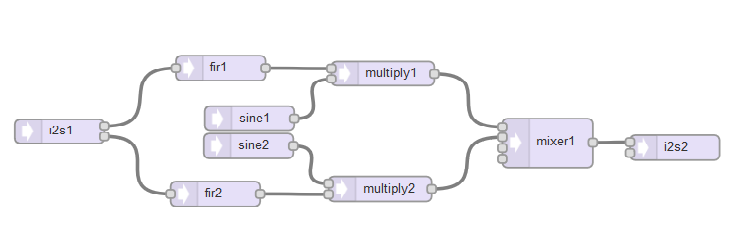

# AudioWeaverModem
Weaver (Third Method) SSB Modulator/Demodulator for Teensy Audio Library

I've been using my Teensy Weaver demod audio object as my "daily driver" for SDR SSB demodulation for a couple of months now.

I have been using Paul's Audio Library + the Audio Shield for the past year or so with good results, and have become reasonably good at modifying existing objects and writing new ones. The Weaver Demod, using the standard objects is easily coded as:



But since we are concerned about minimizing processing time (to allow for background tasks), I have been looking at writing different blocks to optimize for speed. In particular I have modified Paul's sine generator to produce a quadrature (sine/cosine) pair, modified the mixer block to produce a simple 2 input summer with no bells and whistles, and the same with the multiplier block.

I am now working on combining these three mods into a single block that takes the two filter outputs, internally generates the sin/cos oscillator pair, and does the multiplications and the summation/difference to produce the audio output. If the two quadrature filter outputs are cos(w1.t + phi) and sin(w1.t + phi), and the oscillator frequency is w0, the block will compute

```
y(t) = cos(w1.t + phi) x cos(wo.t) + sin(w1.t + phi) x sin(wo.t)
= 1/2 [(cos((w1-wo)t + phi) + cos((w1+wo)t + phi)] + 1/2 [(cos((w1-wo)t + phi) - cos((w1+wo)t + phi)]
= cos((w1-wo)t + phi)
```

or cos((w1+wo)t + phi) if a subtraction is used. In other words, it's a frequency shifter. (Of course, we will have to worry about digital aliasing if w1+w2 > w_Nyquist -- see the tutorial in my previous post.)

I also have a decimator/interpolator pair of functions fully working with the audio library. Given the heavy low-pass filtering by the Weaver filters at <2000 Hz, it should be possible to decimate the 44.1 kHz data stream by a factor of 4, and interpolate the audio output by 4. I'll be trying this after the getting the demod object working.

It's working great, with one problem - which is in fact predicted in the analysis of the method.

The Weaver method requires DC coupling of the quadrature signal components after translation to baseband. The Teensy Audio board has a coupling capacitor of 2.2 ufd and an input impedance of 100k which create a high-pass filter with f_c of approximately 0.7 Hz. The effect of this is to create a virtual notch-filter (with a bandwidth of 1.5 Hz) in the demodulated spectrum at the final oscillator frequency (1500 Hz in my case).

Now, you might think that such a narrow notch would not cause any noticeable problem with the demodulated audio. The problem is that any narrow band notch filter has a transient response with a significant "ring" - ie a damped oscillation at the notch frequency - it's counter-intuitive! This can be explained through the poles and zeros of the notch-filter transfer function. Any noise spikes or sudden changes in the rf signal causes a "ringy" quality to the audio. It's very noticeable/annoying, and I've spent quite a bit of time looking at it on the 'scope and working on simulations to try to minimize the effect.

My simple fix for now is to put a smaller capacitor in series with the input to the Audio board, which increases the low-frequency cut-off frequency, broadening the width of the notch and increasing the damping of the oscillations in the audio. The effect is still there but not nearly as noticeable.

If anybody is interested I can let you have the full analysis. (You need to be familiar with linear system theory, and Fourier/Laplace transforms...)

Derek
